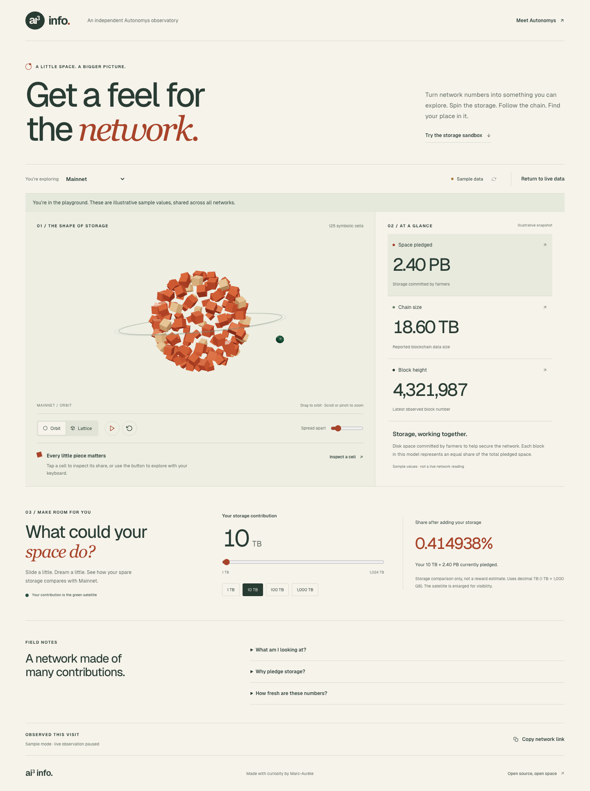

# AI3 Info — Autonomys Network Observatory

[Live app](https://www.ai3.info) · [Autonomys](https://autonomys.xyz) · [Farming documentation](https://docs.autonomys.xyz)

An interactive space explorer for the Autonomys community, retaining the original dark theme, ring and glass-cube models, stars, and Autonomys branding. The root URL opens Mainnet directly. Explore network storage with React Three Fiber, follow readable network statistics, and see how your spare disk space compares with the network.



[Mobile preview](docs/observatory-mobile.png)

## Explore

- **Network readings:** pledged storage, blockchain size, and block height. The in-page network selector navigates to shareable `/space/[networkId]` pages. Available networks come from the Autonomys SDK.
- **Original network space:** the default view preserves the original GLB models, materials, blue lighting, stars, curved readings, and Autonomys logo. Its 64 animated core cubes now support inspection, spread, pause, and reset controls.
- **Optional Storage lab:** 125 instanced cells morph between an orbit and a lattice. Drag to orbit, scroll or pinch to zoom, spread the cells apart, pause rotation, or reset the view. Selecting a metric changes the sculpture’s palette and explanation.
- **Cell inspection:** click a cell or use the keyboard-accessible inspection button to see its portion of the selected storage total. The cells are symbolic equal portions, not real farmers or geographic locations.
- **Storage sandbox:** choose 1–1,024 decimal TB and calculate your share after adding it to the selected network’s pledged space. In the Storage lab, a green satellite represents the contribution, enlarged for visibility. This is a capacity comparison, not a reward prediction.
- **Honest data states:** poll every 30 seconds while the tab is visible, retain the last reading on failure, label cached results, and offer an explicitly labeled sample playground. Recent block readings are observed during the current visit; no historical activity is invented.
- **Accessible alternatives:** readable HTML metrics, labeled controls, keyboard inspection, reduced-motion support, and a WebGL fallback that keeps the statistics and calculator usable.

The original scene loads the existing local GLB models and SVG logo, with a locally served font for its curved readings. The optional Storage lab uses procedural geometry. Both views use instancing, a capped pixel ratio, and on-demand rendering. Automatic rotation stops when paused, offscreen, in a hidden tab, or when reduced motion is requested.

## Development

Use Node.js 20.9+ and npm.

```sh
npm ci
cp .env.example .env.local
npm run dev
```

Open [localhost:3000](http://localhost:3000).

Optional environment variables:

```dotenv
NEXT_PUBLIC_URL=https://www.ai3.info
NEXT_PUBLIC_GOOGLE_ANALYTICS_ID=G-XXXXXXXXXX
KV_REST_API_URL=...
KV_REST_API_TOKEN=...
```

The KV credentials are server-only and enable last-known-reading fallback. Live reads use the SDK’s public RPC endpoints. Without a working connection, the interface offers sample data; it never presents samples as live readings. No environment variables are required to use the sample playground.

## Validation

```sh
npm run lint
npm run typecheck
npm run build
npx playwright install chromium
npm test
```

Browser tests start the production build on port 3100 and mock network responses for repeatability. They verify the root redirect, model assets, logo, and social footer, and cover model controls, inspection, storage math, refresh failures and recovery, sample/cached states, network navigation, mobile keyboard controls, reduced motion, and WebGL failure. To use an existing Chrome installation instead of downloading Chromium, run `PLAYWRIGHT_CHROME=1 npm test`.

TypeScript 7 provides the `tsc` executable via `@typescript/native`. The `typescript` dependency aliases the TypeScript 6 compatibility API required by typescript-eslint, following [Microsoft’s side-by-side setup](https://devblogs.microsoft.com/typescript/announcing-typescript-7-0/#running-side-by-side-with-typescript-6.0).

## Data and architecture

- Next.js 16 App Router, React 19, React Three Fiber, Drei, and Three.js.
- `src/components/Observatory.tsx`: the HTML interface and shared interaction state.
- `src/components/Scene.tsx`: scene controls, rendering lifecycle, and the optional procedural Storage lab.
- `src/components/NetworkModels.tsx`: the original ring, glass cube, logo, curved readings, and lighting, with interactive core cubes.
- `src/utils/useNetworkData.ts`: abortable polling, retries, and session observations.
- `src/utils/storage.ts`: decimal storage formatting and contribution calculations.
- `src/app/api/data/[networkId]/route.ts`: SDK reads and optional KV fallback. Responses preserve formatted values and add raw byte strings, a reading timestamp, and a fallback-cache flag. Older cached payloads remain supported.

The sandbox computes `added bytes / (pledged bytes + added bytes) × 100`. Raw byte strings avoid using rounded display values where possible; older cache entries fall back to parsing their decimal units. Numbers are approximate capacity comparisons, not exact byte accounting.

## Deployment

```sh
npm run build
npm start
```

The application is configured for Vercel and includes robots, sitemap, and Open Graph image routes. See [CONTRIBUTING.md](CONTRIBUTING.md) to contribute.

[MIT license](LICENSE) · Built by [Marc-Aurèle Besner](https://github.com/marc-aurele-besner).
